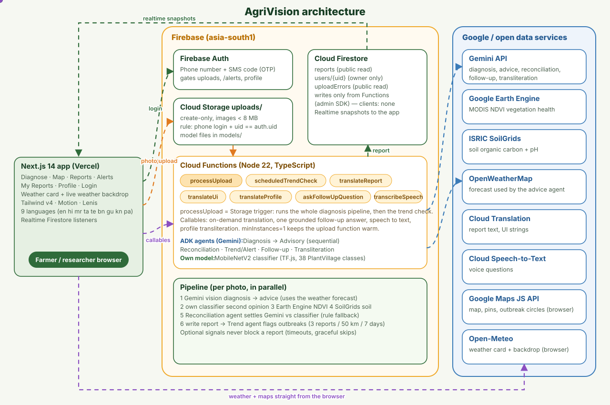
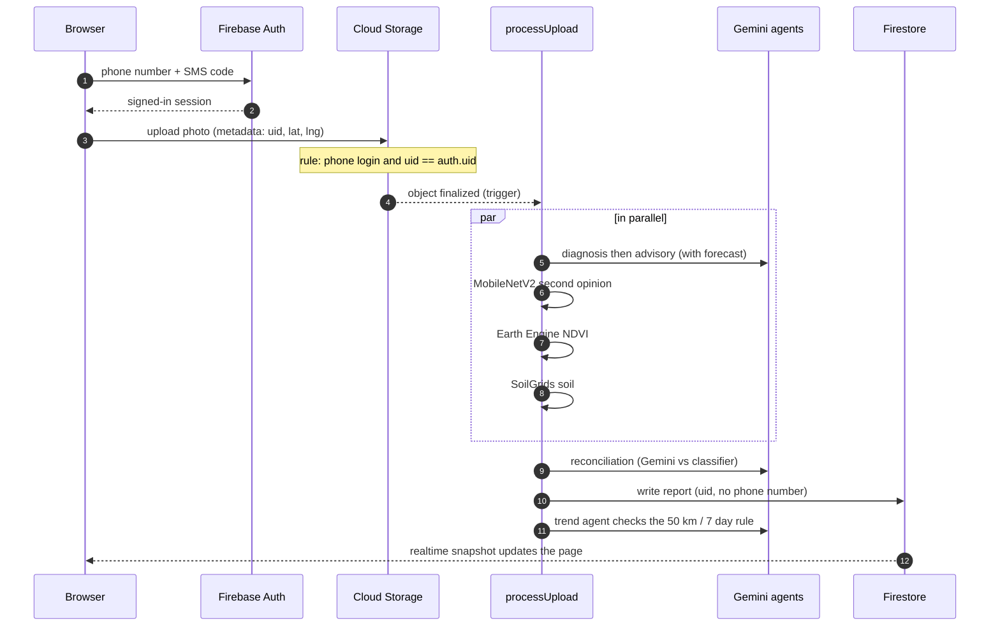
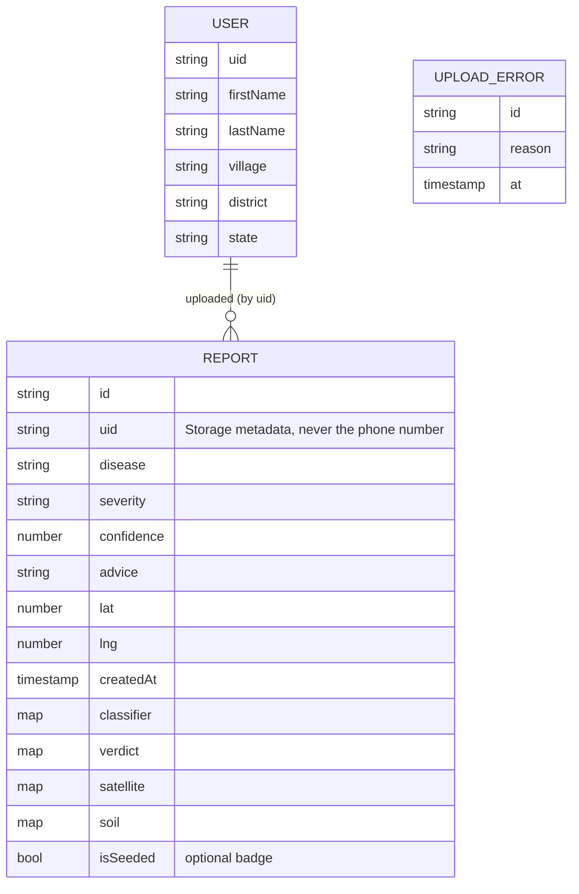

<p align="center">
  
</p>

<p align="center">
  <a href="https://agrivision-silk-psi.vercel.app"></a>
  
  
  
  
  
</p>

**AgriVision** turns a phone photo of a sick leaf into a diagnosis a farmer can act on: the disease, how severe it is, what to do, and when to do it, in the farmer's own language. Every report also lands on a shared map, so a cluster of the same disease in one area becomes an **outbreak alert** for everyone nearby.

> Live site: **https://agrivision-silk-psi.vercel.app**

## A quick tour

<p align="center">
  
</p>

<sub>The tour is an illustration drawn for this README (stylised layouts, not screenshots).</sub>

## What it does

| | |
|---|---|
| **Diagnose** | Upload a leaf photo (or use the camera). Gemini reads the image, our own MobileNetV2 classifier gives a second opinion, and a reconciliation agent settles disagreements. |
| **Advice that fits the day** | The advisory agent reads the local weather forecast to say *when* to spray or wait, and adds a regenerative-farming tip. |
| **Field context** | Satellite vegetation health (Earth Engine NDVI) and soil data (ISRIC SoilGrids) are added when available. They never block a report. |
| **Outbreak alerts** | 3 or more reports of the same disease within 50 km in 7 days raise an outbreak: a ring on the map and an entry on the Alerts page. |
| **Ask a follow-up** | A grounded follow-up agent answers questions about a report, by text or by voice (Speech-to-Text). |
| **Nine languages** | English, Hindi, Marathi, Tamil, Telugu, Bengali, Gujarati, Kannada, Punjabi. Advice is translated on demand; disease and state names use a curated dictionary. |
| **Community** | Phone-number login, My Reports, a community feed with generated names that cannot be linked to a person, and a private profile. |
| **Weather-aware site** | A weather card (today's hours and 7 days) and a full-page scene that follows the real weather. |

## Architecture

<p align="center">
  
</p>

The browser talks to Firebase directly (Auth, Storage upload, realtime Firestore reads). There is **no application server**: everything heavy runs in Cloud Functions, and the results reach the page through Firestore snapshots. Weather and maps are fetched straight from the browser.

### Components

| Layer | Piece | Role |
|---|---|---|
| Frontend | Next.js 14 (App Router), React 18, Tailwind v4, Motion, Lenis | Pages, animation, i18n, realtime listeners. Hosted on Vercel. |
| Auth | Firebase Auth (phone provider) | SMS-code login gating uploads and `/alerts`. |
| Files | Cloud Storage | `uploads/` (create-only, phone-login uid must equal the file's `uid` metadata) and `models/` (classifier). |
| Data | Cloud Firestore | `reports` (public read), `users/{uid}` (owner only), `uploadErrors`. No client writes to reports. |
| Compute | Cloud Functions (Node 22, `asia-south1`) | `processUpload`, `scheduledTrendCheck`, `translateReport`, `translateUi`, `translateProfile`, `askFollowUpQuestion`, `transcribeSpeech`. |
| AI | Google ADK on Gemini | Diagnosis, Advisory, Trend/Alert, Reconciliation, Follow-up, Transliteration agents. |
| ML | TensorFlow.js MobileNetV2 | 38 PlantVillage classes, loaded from Storage inside the function. |
| Data APIs | Earth Engine, SoilGrids, OpenWeatherMap (backend); Open-Meteo, Google Maps (browser) | Field, soil and weather context; map and weather UI. |

### What happens to one photo

<p align="center">
  
</p>



### Agents

| Agent | Input | Output |
|---|---|---|
| Diagnosis | photo, crop, location | disease, severity, confidence, symptoms |
| Advisory | diagnosis, OpenWeatherMap forecast | actions, timing, regenerative tip |
| Reconciliation | Gemini result, classifier result | final verdict. Tools: `compare_symptoms`, `check_class_overlap`. Rule fallback if the model is unavailable. |
| Trend / Alert | recent nearby reports | outbreak decision and alert text |
| Follow-up | a report and a question (ADK session) | grounded answer |
| Transliteration | profile names and places | text in the chosen script |

### Data model



## Security and privacy

- **Login:** Firebase phone auth. Only sign-ins with the `phone` provider can upload.
- **Storage rule:** upload is create-only, size-limited, and `metadata.uid` must equal the signed-in uid, so nobody can upload under someone else's name.
- **Firestore rules:** `reports` and `uploadErrors` are public read with **no client writes**; `users/{uid}` is readable and writable only by its owner (six short string fields).
- **Phone numbers** are never stored on a report. Reports carry only the opaque uid.
- **Community names** are derived from the report id, so two reports by one person cannot be linked.
- Optional signals (satellite, soil, classifier) have timeouts and can never fail a report.
- Secrets live in environment files and Firebase config, not in this repository.

## Weather that touches the cards

<p align="center">
  
</p>

The weather (Open-Meteo, location rounded to about 1 km) drives two layers: a sky at `z-index: -10` behind the page, and a click-through canvas above the cards. Rain lands on the cards, splashes and drips from their edges; the sun leaves a soft reflection on the corner nearest to it; there is also cloud, fog, snow and thunder. It refreshes on its own every 15 minutes and when a background tab returns. It is disabled with the OS "reduce motion" setting.

## Tech stack

**Frontend:** Next.js 14, React 18, Tailwind CSS v4, Motion, Lenis, Radix, lucide-react, Firebase JS SDK v10.
**Backend:** Firebase Cloud Functions (TypeScript, Node 22), Firestore, Storage, Auth, `@google/adk`, `@tensorflow/tfjs`, `@google/earthengine`, Cloud Translation, Cloud Speech-to-Text.
**Model:** MobileNetV2 fine-tuned on PlantVillage (38 classes), exported to TF.js (training code in `training/`).

## Repository layout

```
frontend/      Next.js app (app/, components/, lib/)
functions/     Cloud Functions, ADK agents, tools, offline test scripts
training/      classifier training and export
firestore.rules, storage.rules, firebase.json
docs/assets/   animated SVGs used by this README
TEAM_SUMMARY.md  plain-language project summary
```

## Getting started

Prerequisites: Node 22, a Firebase project (Blaze plan for Functions), a Gemini API key, a Google Maps browser key.

**1. Frontend**

```bash
cd frontend
cp .env.local.example .env.local   # fill in the NEXT_PUBLIC_FIREBASE_* values and NEXT_PUBLIC_GOOGLE_MAPS_API_KEY
npm install
npm run dev
```

**2. Functions**

```bash
cd functions
cp .env.example .env               # add your own keys (Gemini, OpenWeatherMap, ...)
npm install
npm run build
```

**3. Try the pipeline offline** (no deploy needed; needs the keys above)

```bash
cd functions
npm run test:pipeline
```

Other scripts in `functions/scripts/` exercise single parts: `testClassifier`, `testReconciliation`, `testFollowUp`, `testTrend`, `testSoilGrids`, `testWeather`, `testSpeech`, `testTransliteration`, `testRetry`.

**4. Deploy**

```bash
firebase deploy --only functions,firestore:rules,storage --project <your-project-id>
```

The frontend deploys from the Git repository to Vercel.

For local login tests, `NEXT_PUBLIC_AUTH_EMULATOR=1` points the app at the Firebase Auth emulator.

## Known limits

- Gemini on the free tier allows about 5 requests a minute and roughly 20 a day, so heavy use can delay or skip a diagnosis. A paid tier or Vertex AI is the fix.
- Interface translations are AI-written and should be reviewed by native speakers.
- The classifier knows 38 PlantVillage classes; anything else relies on Gemini alone.
- Weather effects are untested on low-end phones.

## Team

Built for a hackathon. See [TEAM_SUMMARY.md](TEAM_SUMMARY.md) for a plain-language walkthrough.
